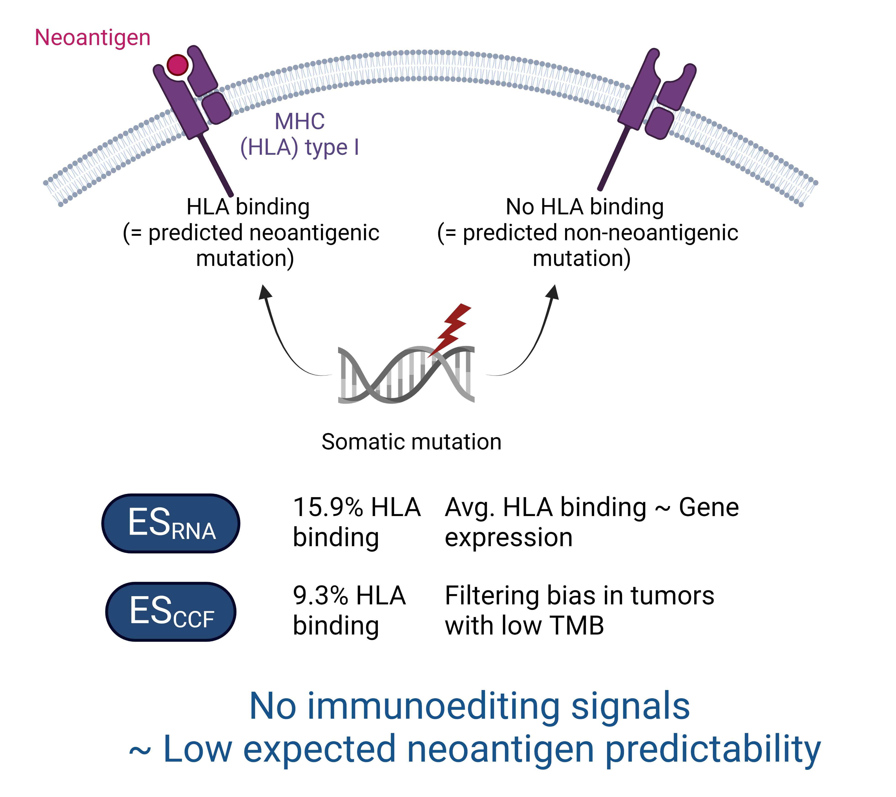

# Analysis to demonstrate that the ES RNA analysis reported in the manuscript of [Wu et al., 2022](https://aacrjournals.org/cancerres/article/82/12/2226/699353/Quantification-of-Neoantigen-Mediated) is unrelated to immunoediting.

# Environment
  
Analysis was performed in a Conda environment. See **immunoediting_canRes.yml** for details. 

# Mutation data

Three different somatic mutation datasets were used in this study

## TCGA Data derived from [Wu et al, 2022](https://aacrjournals.org/cancerres/article/82/12/2226/699353/Quantification-of-Neoantigen-Mediated)

from https://github.com/XSLiuLab/Immunoediting

- all_mut_tpm_not_filter.rds

## Random somatic mutation data derived from [Van den Eynden et al., 2019](https://www.nature.com/articles/s41588-019-0532-6) 

from https://zenodo.org/record/2621365/files/TCGA_maf_sim.rds.

- TCGA_manifest.RData
- TCGA_maf_sim.rds
- GPPM_inclHLAAlleles.rds

## Newly generated random somatic mutation data with matched expression data from GTEx

GTEx data derived from https://storage.googleapis.com/gtex_analysis_v8/rna_seq_data/GTEx_Analysis_2017-06-05_v8_RNASeQCv1.1.9_gene_median_tpm.gct.gz

# ES_RNA Analysis (Fig. S1)

We used the *cales_t.R* method as available on https://github.com/wt12318/NeoEnrichment/

## Fig. S1A. Using TCGA somatic mutation and expression data as reported by Wu et al., 2022

```{r}
source("scripts/ES_rna_analysis_wu.R")
```

## Fig. S1B. Using random somatic somatic mutation data with gene expression data from TCGA from Van den Eynden et al, 2019

```{r}
source("scripts/ES_rna_analysis.R")
```

## Fig. S1C. Using newly generated random somatic somatic mutation data with gene expression data from GTeX.

### Take 100,000 random mutations

```{r}
source("scripts/create_gppm_rand")
```

### Calculate ES RNA

```{r}
source("scripts/ES_rna_analysis_GTex.R")
```

# Analysis of the correlation between neoantigenicity and gene expression in the absence of immunoediting (Fig. S2)

Random somatic mutation with expression data from GTEx (cf fig. S1C)

## Fig. S2B. Perform GSEA on non-expressed genes

```{r}
source("scripts/perform_GSEA.R")
```

## Fig. S2A, C-E. Get predicted neoantigens for GPCR, OR, n HP amino acids

```{r}
source("scripts/get_predicted_neoantigens.R")
```

# ES_CCF Analysis (Fig. S3)

We used the *cal_es_new_test.R* method as available on https://github.com/wt12318/NeoEnrichment/

## Fig. S3A-D. Correlation analysis between TMB and A) ES CCFF, B) % predicted neoantigens, C) % included samples, D) randomly expected samples without predicted neoantigens 

```{r}
source("scripts/CCF_analysis.R")
```

## Fig. S3E-H. ES CCF and TMB correlations after randomly shuffling neoantigen labellings in the prefiltered data. 

```{r}
source("scripts/ES_CCF_random_shuffling_analysis.R")
```

# Merge all figure panels

```{r}
source("scripts/create_final_figs.R")
```

# Conclusion



Both the reported ES RNA and ES CCF results are not related to immunoediting but rather caused by a gene expression and a filtering bias, respectively. 


